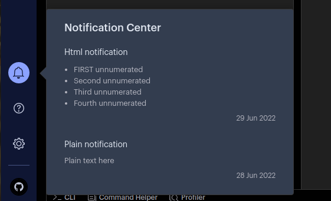

## Notifications


In-app notifications used to notify users about internal events inside RedisInsight app (TBD) and major events related to a Redis company

This repository used to manage "global" notifications which are distributed to all RedisInsight app users

## Structure

All notifications are stored inside `notifications.json` in the root of a repository
To manage notifications it is enough to edit this json file

### notifications.json example
```json
{
    "notifications": [
        {
            "title": "Plain notification",
            "body": "Plain text here",
            "timestamp": 1656374400
        },
        {
            "title": "Html notification",
            "body": "<ul><li>FIRST unnumerated</li><li>Second unnumerated</li><li>Third unnumerated</li><li>Fourth unnumerated</li></ul>",
            "timestamp": 1656460800
        },
        {
            "title": "Notification with link",
            "body": "Try to click <a href=\"link here\">here</a> fro more details",
            "timestamp": 1656547200
        }
    ]
}
```

Each notification is an object under `notifications` array field of the json
with a such structure

| Prop | Type | Description |
| --- | --- | --- |
| title (**required**)      | string |  |
| body (**required**)       | string | text/html |
| timestamp (**required**)  | integer | Number of **seconds** since 1970.01.01T00:00:00  |

**timestamp** and **type** ("global" in our case) will be used as an id
in the RedisInsight database, so it is very important to keep them unique and not change
unless you understand why you do it. Also, **timestamp** used to represent notification
date in the list and for sorting. So it is better to rely on current or
planned notification release date and convert it to timestamp using,
for example this [tool](https://www.epochconverter.com/)

## How to manage notifications
### How to add

Let's assume that you have 2 notifications inside a `notifications.json`
```json
{
    "notifications": [
        {
            "title": "Plain notification",
            "body": "Plain text here",
            "category": "Release",
            "categoryColor": "#ffffff",
            "timestamp": 1656374400
        },
        {
            "title": "Html notification",
            "body": "<ul><li>FIRST unnumerated</li><li>Second unnumerated</li><li>Third unnumerated</li><li>Fourth unnumerated</li></ul>",
            "category": "Release",
            "categoryColor": "#ffffff",
            "timestamp": 1656460800
        }
    ]
}
```


To add new notification we just need to add new object inside `notifications` array
at any position since RedisInsight will sort them anyway.
```json
{
    "notifications": [
        {
            "title": "Plain notification",
            "body": "Plain text here",
            "category": "Release",
            "categoryColor": "#ffffff",
            "timestamp": 1656374400
        },
        {
            "title": "Html notification",
            "body": "<ul><li>FIRST unnumerated</li><li>Second unnumerated</li><li>Third unnumerated</li><li>Fourth unnumerated</li></ul>",
            "category": "Release",
            "categoryColor": "#ffffff",
            "timestamp": 1656460800
        },
+        {
+            "title": "Notification with link",
+            "body": "Try to click <a href=\"\">here</a> fro more details",
+            "timestamp": 1656547200
+        }
    ]
}
```
However, it is better to use any comfortable order or "rules" to make manage process
more comfortable.

After marge into `latest` branch and RedisInsight sync with `notifications.json`
you will see it as a toast message in the left corner of RedisInsight app.


### How to edit
We've added a possibility for editing existed notifications (just in case of a typo)

You can change anything inside any notification (!except **timestamp** field) and all
changes will be applied after next sync !**silently** (without notifying user about any changes)

In case if you changed **timestamp** it will be treated like a
**deletion of old notification and adding a new one**, so user will be notified about it
in the same way like for a new notification

### How to delete
Just delete notification from the `notifications` array and after sync with RedisInsight
this notification will be **silently** removed from the Notification Center

## Notifications auto update and dev process


