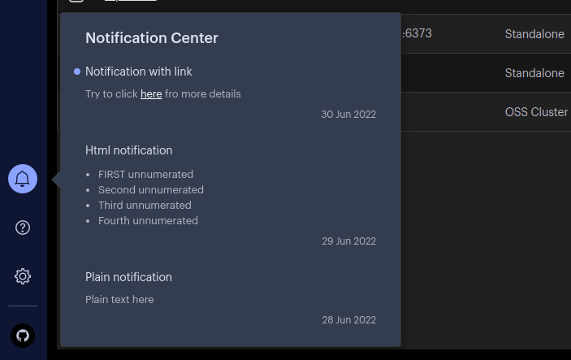
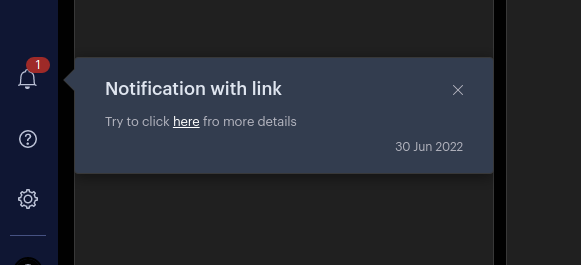
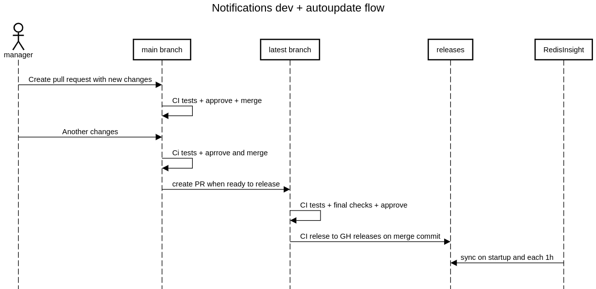

## Notifications


In-app notifications allow to inform users about any updates, news or events inside of RedisInsight.

This repository used to manage "global" notifications which are distributed to all RedisInsight app users

## Structure

All notifications are stored inside the `notifications.json` in the root of the repository.
To manage notifications it is enough to edit this json file.

### notifications.json example
```json
{
    "notifications": [
        {
            "title": "Plain notification",
            "body": "Plain text here",
            "timestamp": 1656374400
        },
        {
            "title": "Html notification",
            "body": "<ul><li>FIRST unnumerated</li><li>Second unnumerated</li><li>Third unnumerated</li><li>Fourth unnumerated</li></ul>",
            "timestamp": 1656460800
        },
        {
            "title": "Notification with link",
            "body": "Try to click <a href=\"link here\">here</a> fro more details",
            "timestamp": 1656547200
        }
    ]
}
```

Each notification is an object under the `notifications` array field of the json
with the following structure.

| Prop | Type | Description |
| --- | --- | --- |
| title (**required**)      | string |  |
| body (**required**)       | string | text/html |
| timestamp (**required**)  | integer | Number of **seconds** since 1970.01.01T00:00:00  |

**timestamp** and **type** ("global" in our case) will be used as an id
in the RedisInsight database, so it is very important to keep them unique and not change
unless you understand why you do that. Also, the **timestamp** is used to represent the notification
date in the list and for sorting. So it is better to rely on the current or
planned notification release date and convert it to the timestamp using,
for example, this [tool](https://www.epochconverter.com/)

## How to manage notifications
### How to add

Let's assume that there are 2 notifications inside of the `notifications.json`
```json
{
    "notifications": [
        {
            "title": "Plain notification",
            "body": "Plain text here",
            "timestamp": 1656374400
        },
        {
            "title": "Html notification",
            "body": "<ul><li>FIRST unnumerated</li><li>Second unnumerated</li><li>Third unnumerated</li><li>Fourth unnumerated</li></ul>",
            "timestamp": 1656460800
        }
    ]
}
```


To add new notification, add a new object inside the `notifications` array (though it can be added at any position since RedisInsight will sort notifications by the timestamp, please insert a new notification to the top to easily navigate through the file).

```json
{
    "notifications": [
        {
            "title": "Plain notification",
            "body": "Plain text here",
            "timestamp": 1656374400
        },
        {
            "title": "Html notification",
            "body": "<ul><li>FIRST unnumerated</li><li>Second unnumerated</li><li>Third unnumerated</li><li>Fourth unnumerated</li></ul>",
            "timestamp": 1656460800
        },
+        {
+            "title": "Notification with link",
+            "body": "Try to click <a href=\"\">here</a> fro more details",
+            "timestamp": 1656547200
+        }
    ]
}
```

After making all the changes, merge the updated `notifications.json` into the `latest` branch. RedisInsight checks new notifications on the application start-up or each 1 hour (at '00) if the application is not closed. When changes are captured, RedisInsight will display the notification.




### How to edit
If there is any information that should be changed in the notifications already published (e.g. a typo), change the information in the `notifications.json` and merge it to the latest branch. RedisInsight will capture the updates according to standard rules and display them in the Notification Center.

If the **timestamp** has not been changed, then the notification will be updated silently, if it has been changed then the previous notification will be deleted and a new one will be posted (with the same rules as applied for new notifications).


### How to delete
If a notification should be deleted, then just delete the notification from the `notifications.json` and merge it to the latest branch. After capturing the changes, RedisInsight will silently remove the notification from the Notification Center.

## Notifications auto update and dev process


